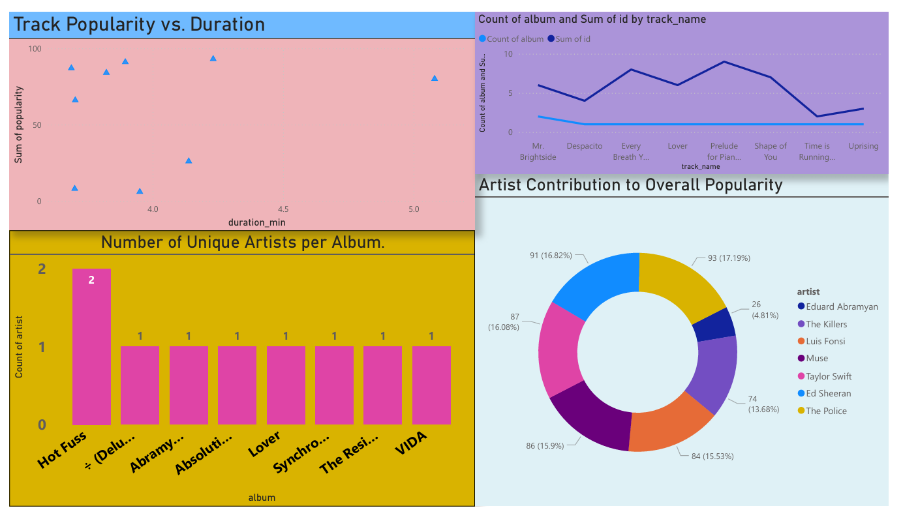
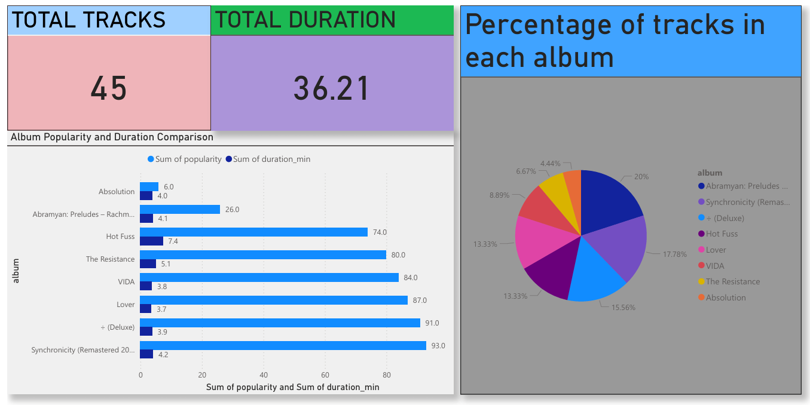

# Spotify ETL Project 🎵

This project extracts Spotify track data using the Spotify Web API, transforms it, and loads it into visualizations using Power BI.

## Features
- Extracts track info from Spotify
- Cleans and stores data
- Visualizes data in Power BI

## Files
- `etl_script.py` - Core ETL logic
- `track_urls.txt` - List of Spotify tracks to process
- `spotify bar graph.pbix` - Power BI visualization

## How to Run
1. Clone the repo
2. Run `etl_script.py` with Python 3
3. Open `.pbix` in Power BI

## 📊 Sample Visualization from Power BI
### 🎵 Spotify Power BI Dashboard 1

### 🎵 Spotify Power BI Dashboard 2

